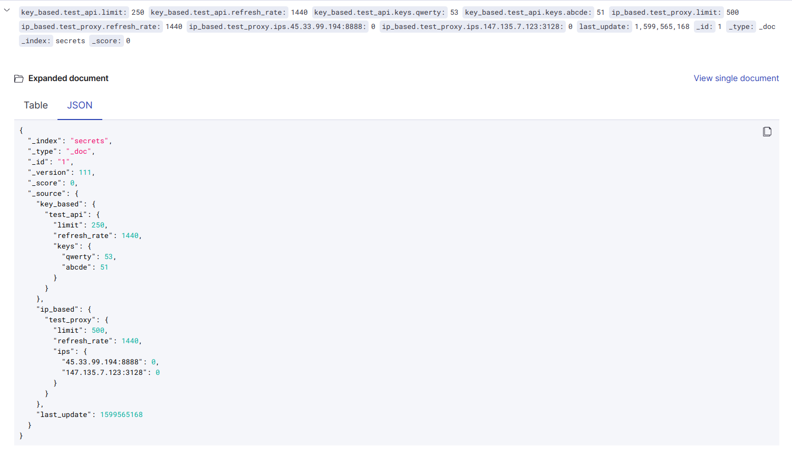
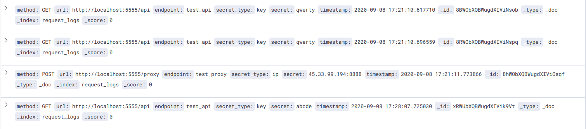

<div align='center'>
  
# Proxy Manager

[](https://forthebadge.com)

</div>

A python requests-middleware that logs and caches the requests sent through it, manages the API key limits and IP ban limits. Also, includes a Kibana dashboard to visualize the statistics. The repository also includes a Flask server configuration that could be used instead of the requests-middleware.

## Request Middleware

* A python class that acts as a wrapper of the python requests library
* Logs and caches all the requests sent using it in Elasticsearch
* Manages the API key rate limits and IP limits by rotating the keys or IPs depending upon their usage counts
* Send batch requests asynchronously (yet to be added)

## Monitor

* Elastic Stack comprising of Elastic Search, Logstash and Kibana is used
* All the incoming requests are saved to Elastic Search along with their responses
* These saved responses could be user as cache
* The logs of the flask server are recorded in Logstash
* Kibana dashboard is used for keeping track of the logs and requests

## Setup

### Setting up Elastic Stack-Monitor
```
cd Monitor/
docker-compose up
```

### Using the requests_middleware
```py
from request_middleware.request import Request

URL = ""

# instantiate Request object
req = Request(key_or_ip, endpoint_name_as_per_config_json, cache=True)

# get the secret key/ip
key = req.get_key_proxy()

headers = {"key": key}

# modify headers
req.add_user_agent(headers)

# send request
response = req.send(method_type, URL,
                    headers=headers, data={})

req.close_session()
```

### Running tests
```
python3 test.py
```

## Server

* A flask application with an endpoint to handle the incoming requests
* Forward all the requests and fetch appropriate responses
* Scalable as there can be huge number of requests at the same time based on CPU utilization
* Load balances across the various nodes

### Setting up Flask-Server
```
cd Server/
docker build . -t flask-proxy-server
```

### Running the kubernetes nodes and autoscaling
```
sudo minikube start --vm-driver=none
kubectl apply -f Server/deployment.yaml
kubectl autoscale deployment flask-proxy-server --cpu-percent=50 --min=1 --max=10
```

`python3 proxy.py` A script for simulate high load on the server 

## Dashboard

### Secrets.json


### Cache.json format in ElasticSearch
```
{
    "_index": "cache",
    "_type": "_doc",
    "_id": "KBWDbXQBWugdXIVikbkz",
    "_version": 1,
    "_score": 0,
    "_source": {
        "method": "GET",
        "url": "http://localhost:5555/api",
        "data": {
            "dummy": "new_data"
        },
        "params": {},
        "response": {
            "status": "Success",
            "message": "Request successful" 
        }
    }
}
```

### Logs index in ElasticSearch


## Contributing

Open to enhancements & bug-fixes
